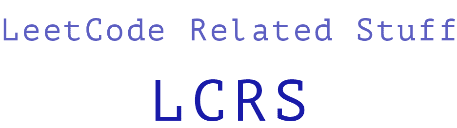

[](https://www.codefactor.io/repository/github/everlookneversee/lcrs)


## Authors
* Milad Sadeghi DM - [EverLookNeverSee@GitHub](https://github.com/EverLookNeverSee)
* See all contributors list [here](https://github.com/EverLookNeverSee/LCRS/graphs/contributors).


## Installing the dependencies and running the tests
1. Creating a python virtual environment:
```commandline
python -m  venv virtual_environment_name
```
2. Activating venv:
```commandline
source virtual_environment_name/bin/activate
```
3. Installing project dependencies:
```commandline
python -m pip install -r requirements.txt
```
4. Running tests:
```commandline
pytest -v tests/
```


## Solved problems
* Easy:
    * is_isomorphic
    * number_of_one_bits
    * number_of_good_pairs
    * two_Sum
    * hamming_distance
    * length_of_last_word
    * sorting_the_sentence
    * is_palindrome
    * height_checker
    * binary_search
    * search_insert_position
    * squares_of_a_sorted_array
    * move_zeros
    * valid_palindrome
    * Best_time_to_buy_and_sell_stock
    * Valid_parentheses
    * Reverse linked list
* Medium:
    * binary_subarrays_with_sum
* Hard:
    * median_of_two_sorted_arrays
    * first_missing_positive
    * sliding_window_median

**Work in progress...**
